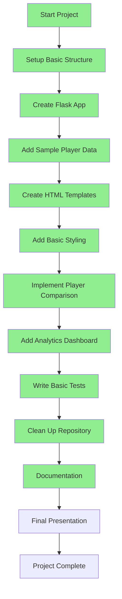

# TalentHawk Project Roadmap

## Task Status

### Completed Tasks (DONE)
- ✅ Setup Basic Structure
- ✅ Create Flask App
- ✅ Add Sample Player Data
- ✅ Create HTML Templates
- ✅ Add Basic Styling
- ✅ Implement Player Comparison
- ✅ Add Analytics Dashboard
- ✅ Write Basic Tests
- ✅ Clean Up Repository
- ✅ Documentation

### Remaining Tasks
- [ ] Final Presentation
  - Prepare slides
  - Demo the application
  - Show key features
  - Explain the code structure
  - Q&A session

## Small Tweaks Needed
1. Test all routes manually to ensure they work
2. Check if all charts are displaying correctly
3. Verify that player comparisons work properly
4. Make sure the analytics page loads all visualizations
5. Test the application on different browsers

## Final Steps
1. Run through the application one final time
2. Prepare presentation materials
3. Merge develop branch into master
4. Present the project 